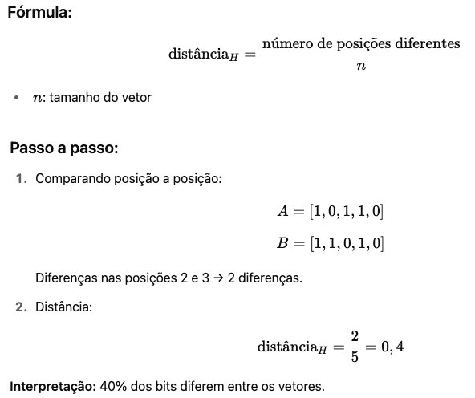

# 🔍 Detalhamento dos Tópicos de Estudo

Este documento irá abordar os detalhes dos tópicos de estudo.

---

## Distância de Hamming

- Objetivo: A distância de Hamming mede o número de posições em que dois vetores (ou cadeias de caracteres) são diferentes.
- Artigo de origem: [Error Detecting and Error Correcting Codes](https://ieeexplore.ieee.org/document/6772729)
- Algumas propostas práticas de solução:
	- [Comparison of genomic sequences using the Hamming distance](https://www.sciencedirect.com/science/article/abs/pii/S037837580400268X)
 		- Objetivo Geral: Este artigo se debruça sobre o problema da homogeneidade entre grupos, especificamente através da comparação de sequências genômicas. O cerne da questão é determinar se diferentes grupos de sequências genômicas são semelhantes ou diferentes. A técnica proposta utiliza a distância de Hamming para determinar a similaridade ou dissimilaridade entre as sequências genômicas.
	- [Fingerprint - Iris Fusion Based Identification System Using a Single Hamming Distance Matcher](https://ieeexplore.ieee.org/abstract/document/5376876)
 		- Objetivo Geral: Este artigo aborda os desafios enfrentados pelos sistemas convencionais de identificação biométrica multimodal (sistema que combina duas ou mais modalidades biométricas distintas para autenticar ou identificar um indivíduo). Para superar essas limitações, os autores propõem um framework de ponta. Este framework se destaca por sua adaptabilidade a qualquer tipo de biometria e por oferecer uma menor ocupação de memória e uma implementação mais rápida em comparação com os sistemas convencionais. A eficácia do framework proposto é verificada através do desenvolvimento de um sistema de fusão de impressões digitais e íris. A característica central deste sistema de fusão é a utilização de um único comparador baseado na distância de Hamming. O resultado principal é que este sistema integrado (fusão) proporciona uma maior precisão em comparação com os sistemas unimodais individuais (apenas impressão digital ou apenas íris).
	- [Hamming distance based approximate similarity text search algorithm](https://ieeexplore.ieee.org/abstract/document/7184772?casa_token=owHLjvbsgGMAAAAA:ASPc-NJa4u9XsrGbfOdo3RAF3VSeWPMmg_evoBfM8NBa3mW25ABwS3xHnHKPyTiaiYbUiG6FpA)
- É utilizado em quais estruturas de dados?
	- Sequências binárias (strings de 0s e 1s) que podem representar presença/ausência.
	- Sequências de caracteres de comprimento fixo para comparação de palavras ou cadeias de texto de mesmo tamanho.
	- Sequências de DNA/RNA: Representadas como sequências de nucleotídeos (A, T, C, G).
	- Vetores de características (feature vectors) de tamanho fixo, onde cada posição representa uma característica específica e o valor pode ser binário (presença/ausência).

 
