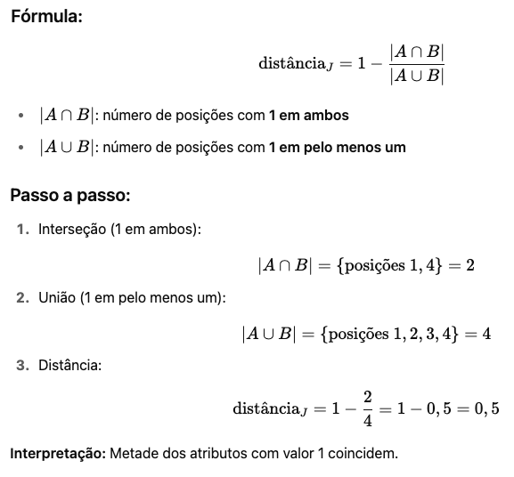

# 🔍 Detalhamento dos Tópicos de Estudo

Este documento irá abordar os detalhes dos tópicos de estudo.

---

## Distância de Jaccard

- Objetivo: Distância de Jaccard (ou o Coeficiente de Similaridade de Jaccard, do qual a distância é 1 menos a similaridade) mede a dissimilaridade entre dois conjuntos.
- Artigo de origem: [Nouvelles recherches sur la distribution florale](https://www.researchgate.net/publication/242013831_Nouvelles_Recherches_Sur_la_Distribution_Florale)
- Algumas propostas práticas de solução:
	- [Measurement of Text Similarity: A Survey](https://www.mdpi.com/2078-2489/11/9/421)
 		- Objetivo Geral: O artigo se propõe a fazer uma análise sistemática do estado da arte na medição de similaridade textual, detalhando os pontos fortes e fracos dos métodos existentes, e propondo um sistema de classificação mais abrangente para os algoritmos de similaridade de texto. Ao longo do artigo, é citado a Similaridade de Jaccard, como técnica para comparação de Strings. 
	- [Introducing mothur: Open-Source, Platform-Independent, Community-Supported Software for Describing and Comparing Microbial Communities](https://journals.asm.org/doi/full/10.1128/aem.01541-09)
 		- Objetivo Geral: O artigo introduz o mothur, um software de código aberto, independente de plataforma e com suporte da comunidade, projetado para descrever e comparar comunidades microbianas. O desenvolvimento do mothur surgiu da necessidade de superar as limitações das ferramentas existentes na ecologia microbiana, especialmente diante do crescimento exponencial dos dados de sequenciamento de genes de rRNA 16S. Uma das principais funcionalidades do mothur é permitir a descrição e comparação de comunidades microbianas. A beta-diversidade é precisamente sobre isso – entender o quão diferentes (ou similares) são as comunidades microbianas em diferentes amostras ou ambientes. O coeficiente de Jaccard é uma técnica clássica para esse tipo de comparação. 
	- [An efficient recommendation generation using relevant Jaccard similarity](https://www.sciencedirect.com/science/article/pii/S0020025519300325?casa_token=oyDh6iiMD0wAAAAA:fMzC3zXAJnLShafvs_grbrFy1G5fvrA3FgSGJylHUGspMaVxWwwSW6a7LdWx5jrsu-oDOKRYmUs)
 		- Objetivo Geral: Este resumo aborda o desafio na área de sistemas de recomendação, especificamente em abordagens de filtragem colaborativa. O problema central identificado é que, embora os métodos existentes busquem melhorar a precisão, eles frequentemente o fazem através de abordagens complexas de similaridade, que acabam negligenciando o tempo de computação.
Além disso, muitas das medidas de similaridade tradicionais, ao calcular a similaridade entre usuários ou itens, consideram apenas os itens co-avaliados (aqueles que ambos os usuários ou itens em questão avaliaram). Esta abordagem é vista como "insignificante" (ou seja, ineficaz) para identificar vizinhos relevantes, especialmente em conjuntos de dados esparsos (onde muitos usuários avaliaram poucos itens, resultando em poucas sobreposições de avaliações).
A validação do desempenho dos modelos propostos foi realizada utilizando o MovieLens, um dataset amplamente reconhecido e utilizado no campo dos sistemas de recomendação. O resumo conclui que a similaridade de Jaccard relevante proposta demonstra ser mais precisa e eficaz na geração de recomendações de qualidade em comparação com outros modelos de similaridade tradicionais.
- É utilizado em quais estruturas de dados?
	- Vetores binários: Onde um '1' indica a presença de um item em um conjunto e '0' a ausência.
	- Bags de palavras - "Bag Words" (em processamento de linguagem natural): Conjuntos de palavras únicas de um documento.
	- Listas de atributos: Onde cada lista representa um conjunto de características.

