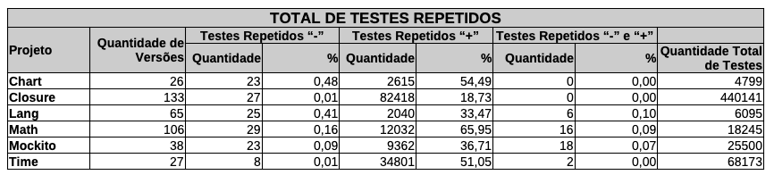
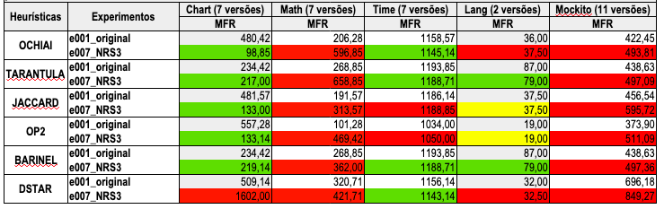
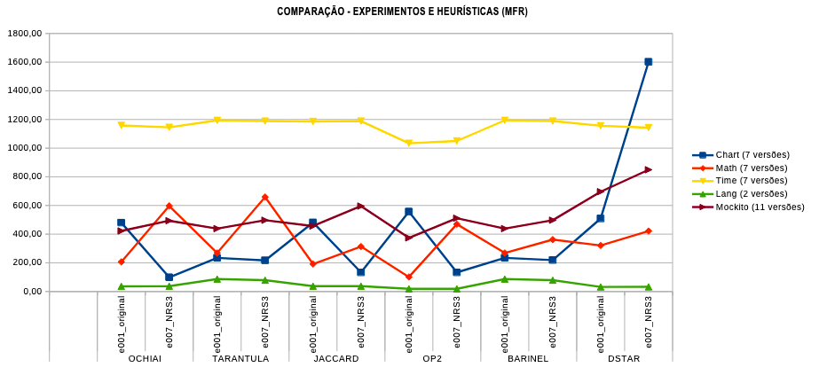

 # 🔬 Detalhamento da Proposta de Exploração II

## Características do ambiente de execução
- Projeto: Defects4J.
- Programas: Chart, Lang, Math, Mockito e Time.
- Métricas: MFR (Mean First Rank).
- Heurísticas: ochiai, tarantula, jaccard, op2, barinel e dstar.
- Quantidade mínima de casos de teste: 6.
- Quantidade mínima de casos de teste "+": 3.
- Quantidade mínima de casos de teste "-": 3.

**Figura 1:** Total de Testes Repetidos (mesma cobertura)

## Descrição dos Experimentos
- **e001_smote_original**
  - Execução das heurísticas aplicadas à matriz de especrtro em seu formato original.
- **e007_smote_euclidian_NR3**
  - Execução das heurísticas aplicadas à matriz de espectro em seu formato transformado, por meio da técnica de eliminação de ruídos (NRS3 – Noise Reduction Scheme 3), a qual consiste em remover todos os casos de teste pertencentes a conjuntos de aprovados e reprovados que apresentem espectros idênticos (mesma cobertura).

## Resultados

**Figura 2:** Tabela - Resultado do Experimento da Proposta de Exploração II (MFR)

**Figura 3:** Gráfico - Resultado do Experimento da Proposta de Exploração II (MFR)

## Análise dos Resultados
- Observou-se que a aplicação da técnica de eliminação de ruídos (NRS3) à matriz de espectro, na maioria dos casos, não contribuiu para a melhoria da eficácia das heurísticas. Verificou-se que 36,66% (representado em verde na Figura 2) dos melhores resultados ocorreram no experimento e007_NRS3, enquanto 56,68% (representado em vermelho na Figura 2) corresponderam ao experimento e001_original. Em 6,66% (representado em amarelo na Figura 2) dos casos, houve empate entre ambos os experimentos.
