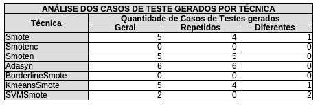

# 🔬 Detalhamento da Proposta de Exploração VIII

## Características do ambiente de execução
- Projeto: Defects4J.
- Programas: Chart.
- Versão: 16.
- Quantidade mínima de casos de teste: 4.
- Quantidade mínima de casos de teste "+": 2.
- Quantidade mínima de casos de teste "-": 2.

## Análise estrutural do dataset (Chart-16)
- Quantidade de Statements: 298
- Quantidade de Casos de Testes "+": 13
- Quantidade de Casos de Testes "-": 8

## Descrição dos experimento
Este experimento propõe uma investigação comparativa entre a técnica de balanceamento SMOTE, em sua versão canônica, e técnicas de balanceamento derivadas do Smote, tais como: Smotenc, Smoten, Adasyn, BorderlineSmote, KMeansSmote e SVMSmote.

- **Smote (Synthetic Minority Over-sampling Technique)**
  - O algoritmo base que cria amostras sintéticas através da interpolação linear entre vizinhos próximos da classe minoritária.
- **Smotenc (Synthetic Minority Over-sampling Technique for Nominal and Continuous)**
  - Essa técnica, é projetada para datasets mistos (Numéricos/Continuous e Categóricos/Nominal)). Ela identifica quais colunas são categóricas e aplica um tratamento diferenciado nelas durante a geração.
- **Smoten (Synthetic Minority Over-sampling Technique for Nominal)**
  - É uma variação do SMOTE dedicada exclusivamente a datasets onde todos os atributos são categóricos (Nominal), utilizando métricas de distância apropriadas para esses tipos de dados.
- **Adasyn**
  - A técnica Adasyn (Adaptive Synthetic), prioriza a geração de dados para exemplos da classe minoritária que são "difíceis de aprender" (aqueles cercados por muitos pontos da classe majoritária).
- **BorderlineSmote**
  - A técnica concentra-se nos dados da classe minoritária localizados próximos à fronteira de decisão, isto é, naqueles mais suscetíveis a erros de classificação. Inicialmente, são identificadas as amostras minoritárias que possuem um grande número de vizinhos pertencentes à classe majoritária, utilizando o algoritmo k-NN. Com base nessa análise, tais amostras são classificadas como dangerous (cercadas predominantemente por instâncias da classe majoritária) ou safe (cercadas majoritariamente por instâncias da própria classe minoritária). A geração de amostras sintéticas é realizada exclusivamente a partir das instâncias classificadas como dangerous.
- **KMeansSmote**
  - Utiliza o algoritmo K-Means para agrupar os dados antes do over-sampling, gerando amostras apenas em clusters onde a classe minoritária é predominante, o que ajuda a evitar a criação de ruído.
- **SVMSmote**
  - Usa um classificador SVM para encontrar os vetores de suporte (os pontos mais próximos da fronteira de decisão) e gera novas amostras ao redor desses pontos críticos.
 
## Resultados
A seguir, são apresentados os resultados da execução das técnicas consideradas neste experimento.

