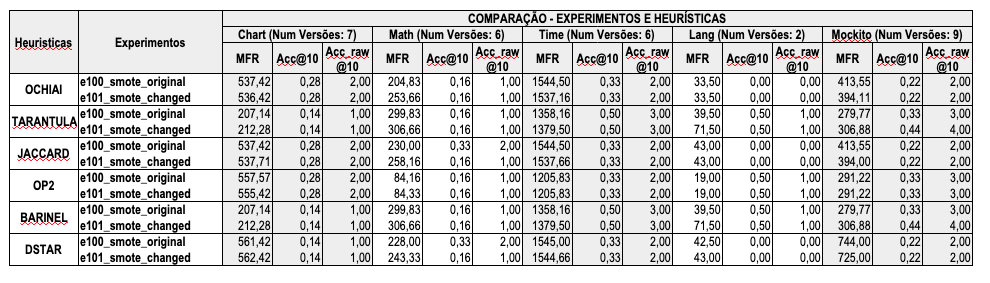
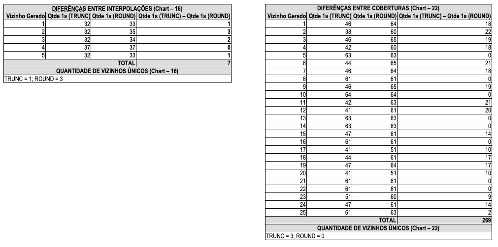
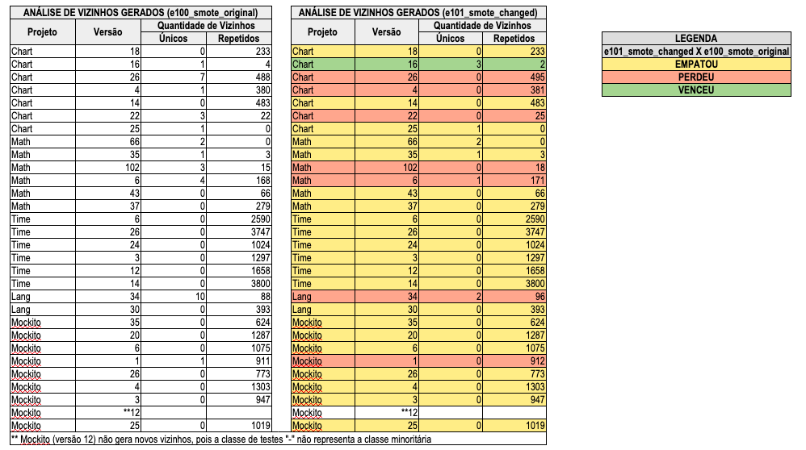
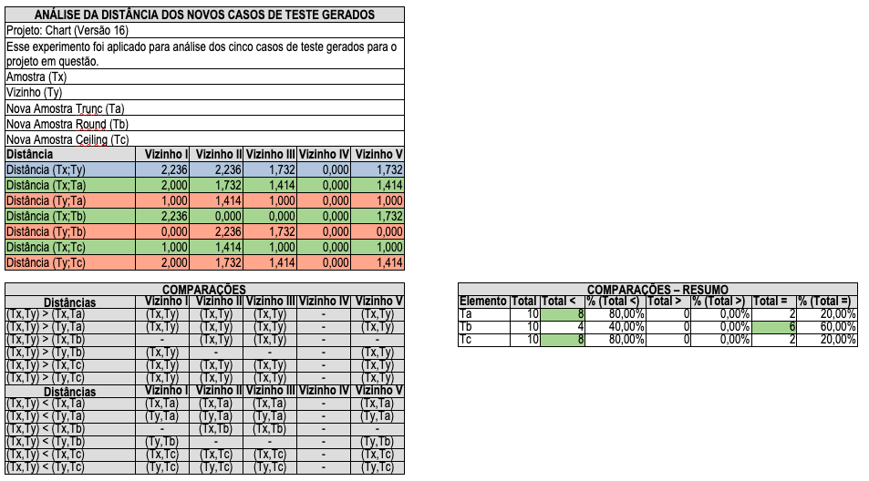

# 🔬 Detalhamento da Proposta de Exploração III

## Características do ambiente de execução
- Projeto: Defects4J.
- Programas: Chart, Lang, Math, Mockito e Time.
- Métricas: MFR (Mean First Rank), ACC@10 e ACC_RAW@10.
- Heurísticas: ochiai, tarantula, jaccard, op2, barinel e dstar.
- Quantidade mínima de casos de teste: 8.
- Quantidade mínima de casos de teste "+": 4.
- Quantidade mínima de casos de teste "-": 4.
- Parametrização do SMOTE:
  - k= Valor mínimo entre quantidade de casos de teste negativos - 2 e 5.

## Descrição dos Experimentos
- **e100_smote_original**
  - Execução das heurísticas aplicadas à matriz de espectro com a técnica de balanceamento de dados SMOTE em sua forma original.
- **e101_smote_changed**
  - Execução das heurísticas aplicadas à matriz de espectro com a técnica de balanceamento de dados SMOTE, porém com uma modificação no algoritmo responsável pela geração de novos vizinhos, de modo a produzir instâncias com maior cobertura — isto é, com maior incidência de valores “1” nas colunas da matriz. 
```Python
def _generate_samples(
        self, X, nn_data, nn_num, rows, cols, steps, y_type=None, y=None
    ):
    ...
    #return X_new.astype(X.dtype)
    return np.round(X_new).astype(X.dtype)        
    ...
```

## Análise I - Métricas MFR, ACC@10 e ACC_RAW@10



**Tabela 1:** Tabela - Resultado do Experimento da Proposta de Exploração III

")

**Gráfico 1:** Análise da métrica MFR

### Conclusões:  
  - A análise dos experimentos e100_smote_original e e101_smote_changed evidenciou que o comportamento da métrica MFR apresenta variações conforme o projeto e a heurística considerada. Notadamente, os projetos Time e Mockito destacaram-se por exibirem, em metade das heurísticas avaliadas (Ochiai, Jaccard e Dstar), desempenho superior no experimento e101_smote_changed em relação ao e100_smote_original.


")

**Gráfico 2:** Análise da métrica ACC@10

### Conclusões:  
  - A análise comparativa entre os experimentos e100_smote_original e e101_smote_changed evidenciou que o comportamento da métrica ACC@10 manteve-se praticamente constante na maioria dos projetos e heurísticas avaliados. A única exceção foi o projeto Mockito, no qual o experimento e101_smote_changed apresentou desempenho superior para as heurísticas Tarantula e Barinel.

")

**Gráfico 3:** Análise da métrica ACC_RAW@10

### Conclusões:
  - A análise comparativa entre os experimentos e100_smote_original e e101_smote_changed evidenciou que o comportamento da métrica ACC@10 manteve-se praticamente constante na maioria dos projetos e heurísticas avaliados. A única exceção foi o projeto Mockito, no qual o experimento e101_smote_changed apresentou desempenho superior para as heurísticas Tarantula e Barinel.

## Análise II - Avaliação da cobertura dos novos vizinhos gerados
Essa análise foi realizada apenas para o projeto Chart, nas versões 16 e 22. O projeto e as versões foram selecionados de forma aleatória. Optou-se por analisar apenas um projeto e duas versões, considerando que se trata de uma investigação bastante detalhada e trabalhosa, especialmente ao se pensar na análise de todos os projetos e suas respectivas versões.



**Tabela 2:** Tabela - Avaliação da cobertura dos novos vizinhos gerados

### Conclusões:
  - A comparação entre as formas de interpolação Trunc e Round evidencia que a utilização da interpolação Round promove um incremento no número de casos de teste com statements cobertos. Contudo, tal incremento não se estende à geração de vizinhos únicos, a qual não apresentou variação significativa com o uso da forma Round.

## Análise III - Avaliação dos novos vizinhos inéditos gerados



**Tabela 3:** Tabela - Avaliação dos novos vizinhos inéditos gerados

### Conclusões:
  - A comparação entre as formas de interpolação Trunc (e100_smote_original) e Round (e101_smote_changed) evidencia que a utilização da interpolação Round não contribuiu, em sua maioria, para a geração de vizinhos únicos. O único projeto em que se observou um aumento na geração de vizinhos únicos, considerando o experimento e101_smote_changed, foi o Chart, versão 16.

## Análise IV - Avaliação da distância dos novos casos de teste gerados pelo balanceamento com a aplicação do Teste Estatístico de Wilcoxon Signed Rank

Um teste estatístico é um método formal e sistemático utilizado para tomar decisões sobre uma população com base em dados de uma amostra. Em sua essência, ele nos permite avaliar a probabilidade de que os resultados observados em um experimento ou estudo sejam devidos ao acaso ou se realmente existe uma relação real entre as variáveis.

Cenário: Avaliar as distâncias dos novos vizinhos gerados (Ta, Tb e Tc) entre os elementos que compõem o par de vizinhos que os geraram (Tx,Ty).

  - Hipótese Nula (H₀): Não há diferença significativa entre as seguintes distâncias observadas: (Tx,Ty) x (Tx,Ta), (Tx,Ty) x (Tx,Tb), (Tx,Ty) x (Tx,Tc), (Tx,Ty) x (Ty,Ta), (Tx,Ty) x (Ty,Tb) e (Tx,Ty) x (Ty,Tc).
  - Hipóteses Alternativas
    - Hipótese Alternativa (H1.a): Hipótese de que as distâncias produzidas pelos novos vizinhos gerados pelo elemento Ta, em combinação com os elementos que compõem o par original de vizinhos (Tx, Ty), são superiores às distâncias observadas entre os próprios vizinhos originais. Em outras palavras, espera-se que: (Tx, Ta) > (Tx, Ty) e (Ty, Ta) > (Tx, Ty).
    - Hipótese Alternativa (H1.b): Hipótese de que as distâncias produzidas pelos novos vizinhos gerados pelo elemento Ta, em combinação com os elementos que compõem o par original de vizinhos (Tx, Ty), são inferiores às distâncias observadas entre os próprios vizinhos originais. Em outras palavras, espera-se que: (Tx, Ta) < (Tx, Ty) e (Ty, Ta) < (Tx, Ty).
    - Hipótese Alternativa (H2.a): Hipótese de que as distâncias produzidas pelos novos vizinhos gerados pelo elemento Tb, em combinação com os elementos que compõem o par original de vizinhos (Tx, Ty), são superiores às distâncias observadas entre os próprios vizinhos originais. Em outras palavras, espera-se que: (Tx, Tb) > (Tx, Ty) e (Ty, Tb) > (Tx, Ty).
    - Hipótese Alternativa (H2.b): Hipótese de que as distâncias produzidas pelos novos vizinhos gerados pelo elemento Tb, em combinação com os elementos que compõem o par original de vizinhos (Tx, Ty), são inferiores às distâncias observadas entre os próprios vizinhos originais. Em outras palavras, espera-se que: (Tx, Tb) < (Tx, Ty) e (Ty, Tb) < (Tx, Ty).
    - Hipótese Alternativa (H3.a): Hipótese de que as distâncias produzidas pelos novos vizinhos gerados pelo elemento Tc, em combinação com os elementos que compõem o par original de vizinhos (Tx, Ty), são superiores às distâncias observadas entre os próprios vizinhos originais. Em outras palavras, espera-se que: (Tx, Tc) > (Tx, Ty) e (Ty, Tc) > (Tx, Ty).
    - Hipótese Alternativa (H3.b): Hipótese de que as distâncias produzidas pelos novos vizinhos gerados pelo elemento Tc, em combinação com os elementos que compõem o par original de vizinhos (Tx, Ty), são inferiores às distâncias observadas entre os próprios vizinhos originais. Em outras palavras, espera-se que: (Tx, Tc) < (Tx, Ty) e (Ty, Tc) < (Tx, Ty).   



**Tabela 4:** Tabela - Avaliação da distância dos novos casos de teste gerados pelo balanceamento

Log com informações sobre o cálculo das distâncias - [Arquivo de Log](https://github.com/Reinaldo-Jr-Dev/doutorado/blob/main/log/smote-log-distancia-vizinhos.txt)

```
Tipo da Distancia,Valor da Distancia
distancia_TX_TY,2.236	
distancia_TX_TY,2.236	
distancia_TX_TY,1.732	
distancia_TX_TY,0.000
distancia_TX_TY,1.732
distancia_TX_TA,2.000	
distancia_TX_TA,1.732	
distancia_TX_TA,1.414
distancia_TX_TA,0.000
distancia_TX_TA,1.414	
distancia_TX_TB,2.236
distancia_TX_TB,0.000
distancia_TX_TB,0.000
distancia_TX_TB,0.000
distancia_TX_TB,1.732
distancia_TX_TC,1.000
distancia_TX_TC,1.414
distancia_TX_TC,1.000
distancia_TX_TC,0.000
distancia_TX_TC,1.000
distancia_TY_TA,1.000	
distancia_TY_TA,1.414
distancia_TY_TA,1.000
distancia_TY_TA,0.000
distancia_TY_TA,1.000
distancia_TY_TB,0.000
distancia_TY_TB,2.236
distancia_TY_TB,1.732
distancia_TY_TB,0.000
distancia_TY_TB,0.000
distancia_TY_TC,2.000
distancia_TY_TC,1.732
distancia_TY_TC,1.414
distancia_TY_TC,0.000
distancia_TY_TC,1.414
```
**CSV a ser lido pela implementação de Wilcoxon Signed Rank**

```Python
import pandas as pd
from scipy.stats import wilcoxon
import numpy as np

# ============================================================================
# LER O CSV
# ============================================================================
df = pd.read_csv('distancias.csv')

# ============================================================================
# DEFINIR PARES DE COMPARAÇÃO
# ============================================================================
pares_comparacao = [
    ('distancia_TX_TY', 'distancia_TX_TA'),
    ('distancia_TX_TY', 'distancia_TX_TB'),
    ('distancia_TX_TY', 'distancia_TX_TC'),
    ('distancia_TX_TY', 'distancia_TY_TA'),
    ('distancia_TX_TY', 'distancia_TY_TB'),
    ('distancia_TX_TY', 'distancia_TY_TC'),
]

# ============================================================================
# APLICAR TESTE DE WILCOXON
# ============================================================================
print("=" * 80)
print("TESTE DE WILCOXON SIGNED RANK")
print("=" * 80)
print()

for tipo1, tipo2 in pares_comparacao:
    
    valores_tipo1 = df[df['Tipo da Distancia'] == tipo1]['Valor da Distancia'].values
    valores_tipo2 = df[df['Tipo da Distancia'] == tipo2]['Valor da Distancia'].values
    
    # Calcular diferenças
    diferencas = valores_tipo1 - valores_tipo2
    
    # Contar zeros
    zeros = np.sum(diferencas == 0)
    n_total = len(diferencas)
    n_nao_zero = n_total - zeros
    
    # Aplicar teste de Wilcoxon
    w, p_valor = wilcoxon(valores_tipo1, valores_tipo2, alternative='two-sided')
    
    # Determinar significância
    significante = 'SIM' if p_valor < 0.05 else 'NÃO'
    
    # Exibir resultado
    print(f"{tipo1} vs {tipo2}")
    print(f"  Diferenças: {diferencas}")
    print(f"  Total de pares: {n_total}")
    print(f"  Zeros descartados: {zeros}")
    print(f"  Pares utilizados: {n_nao_zero}")
    print(f"  W: {w:.2f}")
    print(f"  P-valor: {p_valor:.6f}")
    print(f"  Significante (α=0.05): {significante}")
    print()

print("=" * 80)
```
**Implementação do Teste Estatístico de Wilcoxon Signed Rank**

```
================================================================================
TESTE DE WILCOXON SIGNED RANK
================================================================================

distancia_TX_TY vs distancia_TX_TA
  Diferenças: [0.236 0.504 0.318 0.    0.318]
  Total de pares: 5
  Zeros descartados: 1
  Pares utilizados: 4
  W: 0.00
  P-valor: 0.125000
  Significante (α=0.05): NÃO

distancia_TX_TY vs distancia_TX_TB
  Diferenças: [0.    2.236 1.732 0.    0.   ]
  Total de pares: 5
  Zeros descartados: 3
  Pares utilizados: 2
  W: 0.00
  P-valor: 0.500000
  Significante (α=0.05): NÃO

distancia_TX_TY vs distancia_TX_TC
  Diferenças: [1.236 0.822 0.732 0.    0.732]
  Total de pares: 5
  Zeros descartados: 1
  Pares utilizados: 4
  W: 0.00
  P-valor: 0.125000
  Significante (α=0.05): NÃO

distancia_TX_TY vs distancia_TY_TA
  Diferenças: [1.236 0.822 0.732 0.    0.732]
  Total de pares: 5
  Zeros descartados: 1
  Pares utilizados: 4
  W: 0.00
  P-valor: 0.125000
  Significante (α=0.05): NÃO

distancia_TX_TY vs distancia_TY_TB
  Diferenças: [2.236 0.    0.    0.    1.732]
  Total de pares: 5
  Zeros descartados: 3
  Pares utilizados: 2
  W: 0.00
  P-valor: 0.500000
  Significante (α=0.05): NÃO

distancia_TX_TY vs distancia_TY_TC
  Diferenças: [0.236 0.504 0.318 0.    0.318]
  Total de pares: 5
  Zeros descartados: 1
  Pares utilizados: 4
  W: 0.00
  P-valor: 0.125000
  Significante (α=0.05): NÃO
================================================================================
```
**Resultado da Implementação do Teste Estatístico de Wilcoxon Signed Rank**

### Conclusões:
  - Não há diferença significativa entre as seguintes distâncias observadas: (Tx,Ty) x (Tx,Ta), (Tx,Ty) x (Tx,Tb), (Tx,Ty) x (Tx,Tc), (Tx,Ty) x (Ty,Ta), (Tx,Ty) x (Ty,Tb) e (Tx,Ty) x (Ty,Tc), portanto, as hipóteses alternativas não podem ser confirmadas.
