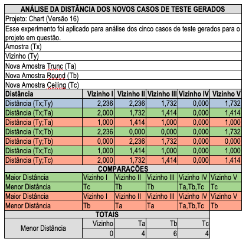

# 🔬 Detalhamento da Proposta de Exploração III

## Características do ambiente de execução
- Projeto: Defects4J.
- Programas: Chart, Lang, Math, Mockito e Time.
- Métricas: MFR (Mean First Rank), ACC@10 e ACC_RAW@10.
- Heurísticas: ochiai, tarantula, jaccard, op2, barinel e dstar.
- Quantidade mínima de casos de teste: 8.
- Quantidade mínima de casos de teste "+": 4.
- Quantidade mínima de casos de teste "-": 4.
- Parametrização do SMOTE:
  - k= Valor mínimo entre quantidade de casos de teste negativos - 2 e 5.

## Descrição dos Experimentos
- **e100_smote_original**
  - Execução das heurísticas aplicadas à matriz de espectro com a técnica de balanceamento de dados SMOTE em sua forma original.
- **e101_smote_changed**
  - Execução das heurísticas aplicadas à matriz de espectro com a técnica de balanceamento de dados SMOTE, porém com uma modificação no algoritmo responsável pela geração de novos vizinhos, de modo a produzir instâncias com maior cobertura — isto é, com maior incidência de valores “1” nas colunas da matriz. 
```Python
def _generate_samples(
        self, X, nn_data, nn_num, rows, cols, steps, y_type=None, y=None
    ):
    ...
    #return X_new.astype(X.dtype)
    return np.round(X_new).astype(X.dtype)        
    ...
```

## Análise I - Métricas MFR, ACC@10 e ACC_RAW@10


**Tabela 1:** Tabela - Resultado do Experimento da Proposta de Exploração III

")

**Gráfico 1:** Análise da métrica MFR

### Conclusões:  
  - A análise dos experimentos e100_smote_original e e101_smote_changed evidenciou que o comportamento da métrica MFR apresenta variações conforme o projeto e a heurística considerada. Notadamente, os projetos Time e Mockito destacaram-se por exibirem, em metade das heurísticas avaliadas (Ochiai, Jaccard e Dstar), desempenho superior no experimento e101_smote_changed em relação ao e100_smote_original.


")

**Gráfico 2:** Análise da métrica ACC@10

### Conclusões:  
  - A análise comparativa entre os experimentos e100_smote_original e e101_smote_changed evidenciou que o comportamento da métrica ACC@10 manteve-se praticamente constante na maioria dos projetos e heurísticas avaliados. A única exceção foi o projeto Mockito, no qual o experimento e101_smote_changed apresentou desempenho superior para as heurísticas Tarantula e Barinel.

")

**Gráfico 3:** Análise da métrica ACC_RAW@10

### Conclusões:
  - A análise comparativa entre os experimentos e100_smote_original e e101_smote_changed evidenciou que o comportamento da métrica ACC@10 manteve-se praticamente constante na maioria dos projetos e heurísticas avaliados. A única exceção foi o projeto Mockito, no qual o experimento e101_smote_changed apresentou desempenho superior para as heurísticas Tarantula e Barinel.

## Análise II - Avaliação da cobertura dos novos vizinhos gerados
Essa análise foi realizada apenas para o projeto Chart, nas versões 16 e 22. O projeto e as versões foram selecionados de forma aleatória. Optou-se por analisar apenas um projeto e duas versões, considerando que se trata de uma investigação bastante detalhada e trabalhosa, especialmente ao se pensar na análise de todos os projetos e suas respectivas versões.


**Tabela 2:** Tabela - Avaliação da cobertura dos novos vizinhos gerados

### Conclusões:
  - A comparação entre as formas de interpolação Trunc e Round evidencia que a utilização da interpolação Round promove um incremento no número de casos de teste com statements cobertos. Contudo, tal incremento não se estende à geração de vizinhos únicos, a qual não apresentou variação significativa com o uso da forma Round.

## Análise III - Avaliação dos novos vizinhos inéditos gerados


**Tabela 3:** Tabela - Avaliação dos novos vizinhos inéditos gerados

### Conclusões:
  - A comparação entre as formas de interpolação Trunc (e100_smote_original) e Round (e101_smote_changed) evidencia que a utilização da interpolação Round não contribuiu, em sua maioria, para a geração de vizinhos únicos. O único projeto em que se observou um aumento na geração de vizinhos únicos, considerando o experimento e101_smote_changed, foi o Chart, versão 16.

## Análise IV - Avaliação da distância dos novos casos de teste gerados pelo balanceamento



**Tabela 4:** Tabela - Avaliação da distância dos novos casos de teste gerados pelo balanceamento

Log com informações sobre o cálculo das distâncias - [Arquivo de Log](https://github.com/Reinaldo-Jr-Dev/doutorado/blob/main/log/smote-log-distancia-vizinhos.txt)

### Conclusões:
  - Ao comparar as distâncias calculadas entre as amostras e seus vizinhos com as distâncias entre as amostras e as novas amostras geradas por meio de interpolação (para os tipos "Trunc", "Round" e "Ceiling"), constatou-se que as distâncias em relação às novas amostras geradas foram, na maioria dos casos, inferiores às distâncias em relação aos vizinhos. Em particular, destaca-se o método de interpolação "Round" que resultou nas menores distâncias.
