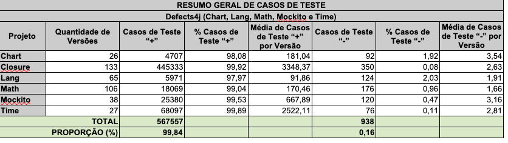
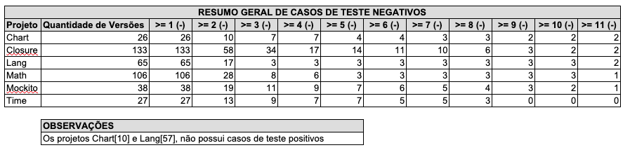
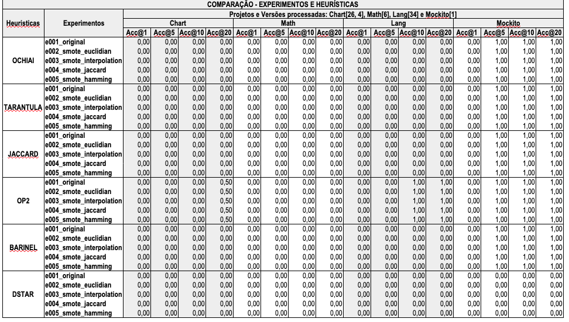
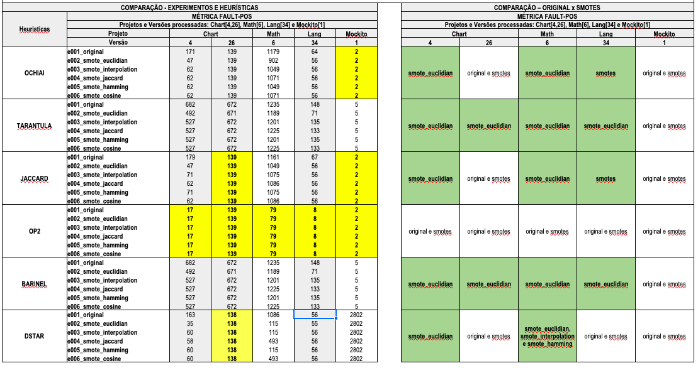
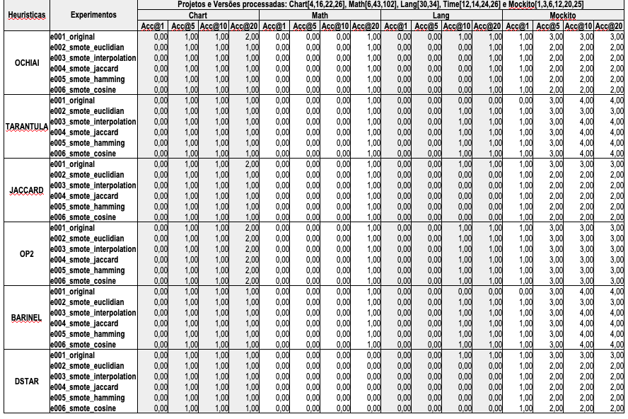

# 🔬 Detalhamento da Proposta de Exploração I

## Características do ambiente de execução I
- Projeto: Defects4J.
- Programas: Chart, Lang, Math, Mockito e Time.
- Métricas: ACC@N e Fault-Pos.
- Heurísticas: ochiai, tarantula, jaccard, op2, barinel e dstar.
- Quantidade mínima de casos de teste: 22.
- Quantidade mínima de casos de teste "+": 11.
- Quantidade mínima de casos de teste "-": 11.



**Figura 1:** Resumo geral dos casos de teste



**Figura 2:** Resumo geral dos casos de teste negativos

## Descrição dos Experimentos
- **e001_original**
  - Execução das heurísticas sem a aplicação de qualquer tipo de balanceamento de dados.
- **e002_smote_euclidian**
  - Execução das heurísticas com a aplicação da técnica de balanceamento de dados SMOTE, utilizando o cálculo de distância Euclidiana. É importante destacar que essa execução foi realizada com o uso da biblioteca "imblearn.over_sampling".
- **e003_smote_interpolation**
  - Execução das heurísticas com a aplicação da técnica de balanceamento de dados SMOTE, utilizando o cálculo de distância Euclidiana. É importante destacar que essa execução foi realizada com o algoritmo original do Smote (sem uso da biblioteca "imblearn.over_sampling") e a geração das novas amostras sintéticas incluiu o arredondamento dos valores dos atributos, em vez do truncamento.
      
```python
#return X_new.astype(X.dtype)        
return np.round(X_new).astype(X.dtype)
```
**Fragmento de Código 1** - Alteração do procedimento da interpolação.

- **e004_smote_jaccard**
  - Execução das heurísticas com a aplicação da técnica de balanceamento de dados SMOTE, utilizando o cálculo de distância de Jaccard. É importante destacar que essa execução foi realizada com o algoritmo original do Smote (sem uso da biblioteca "imblearn.over_sampling").
- **e005_smote_hamming**
  - Execução das heurísticas com a aplicação da técnica de balanceamento de dados SMOTE, utilizando o cálculo de distância de Hamming. É importante destacar que essa execução foi realizada com o algoritmo original do Smote (sem uso da biblioteca "imblearn.over_sampling").
- **e006_smote_cosine**
  - Execução das heurísticas com a aplicação da técnica de balanceamento de dados SMOTE, utilizando o cálculo de distância de Cosine. É importante destacar que essa execução foi realizada com o algoritmo original do Smote (sem uso da biblioteca "imblearn.over_sampling").
 
```python
    def _validate_estimator(self):
        self.nn_k_ = check_neighbors_object(
            "k_neighbors", self.k_neighbors, additional_neighbor=1, 
        )
        self.nn_k_.metric = "cosine"
        #self.nn_k_.metric = "jaccard"
        #self.nn_k_.metric = "hamming"
```
**Fragmento de Código 2** - Definição das métricas de cálculo dos vizinhos
  
## Resultados



**Figura 3:** Resultado do Experimento da Proposta de Exploração I (ACC)



**Figura 4:** Resultado do Experimento da Proposta de Exploração I (FAULT-POS)

## Análise dos Resultados
- Observou-se que os valores de cada heurística exibiram uniformidade ao longo de todos os experimentos simulados. Presume-se que tal ocorrência esteja diretamente relacionada à limitada quantidade de casos de teste remanescentes após a aplicação dos critérios de seleção, que precederam a fase de simulação. 
- A aplicação da métrica Fault-Pos revelou, com maior precisão, que os experimentos que incorporam técnicas de balanceamento demonstram eficácia superior no processo de priorização de defeitos. Dentre as abordagens de balanceamento avaliadas, destaca-se o experimento "e002_smote_euclidian", que obteve os resultados mais promissores.

---

## Características do ambiente de execução II
- Projeto: Defects4J.
- Programas: Chart, Lang, Math, Mockito e Time.
- Métricas: ACC@N-RAW.
- Heurísticas: ochiai, tarantula, jaccard, op2, barinel e dstar.
- Quantidade mínima de casos de teste: 11.
- Quantidade mínima de casos de teste "+": 6.
- Quantidade mínima de casos de teste "-": 6.



**Figura 5:** Resultado do Experimento da Proposta de Exploração I (ACC_RAW)

## Análise dos Resultados
- Observou-se que os valores de cada heurística exibiram uniformidade ao longo da maioria dos experimentos simulados. Presume-se que tal ocorrência esteja diretamente relacionada à quantidade pequena de casos de teste negativos.

---

## Nova Proposta de Exploração
- A análise dos resultados desta investigação revelou a ocorrência de um número significativo de casos de teste com cobertura idêntica, manifestada por linhas de statements coincidentes. Adicionalmente, constatou-se que a aplicação de técnicas de balanceamento de casos de teste em múltiplos experimentos não resultou em melhoria significativa da eficácia das heurísticas SBFL. Com base nessas duas evidências, propõe-se explorar o procedimento de eliminação de ruídos na matriz de espectro, especificamente através da remoção de casos de teste de mesma cobertura. Estima-se que tal procedimento possa contribuir significativamente para a eficácia das heurísticas SBFL. Será utilizado o artigo [Noise Reduction for Spectrum-based Fault Localization](https://github.com/Reinaldo-Jr-Dev/doutorado/blob/article/Noise_Reduction_for_Spectrum_based_Fault_Localization.pdf) para nos guiar nessa nova proposta de exploração.
