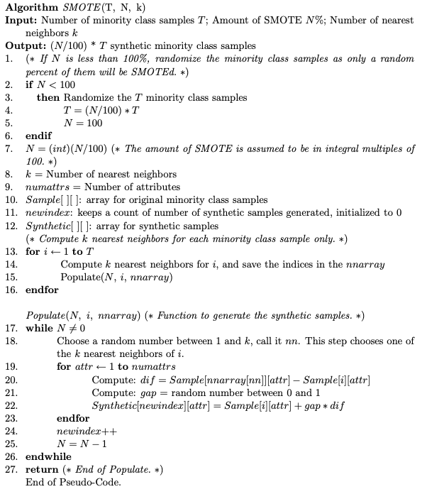

# 🔍 Detalhamento dos Tópicos de Estudo

Este documento irá abordar os detalhes dos tópicos de estudo.

---

## SMOTE (Synthetic Minority Over-sampling Technique)

A técnica SMOTE propõe uma abordagem de sobreamostragem em que a classe minoritária é sobreamostrada através da criação de exemplos “sintéticos” em vez de sobreamostragem com substituição. Esta abordagem é inspirada em uma técnica que provou ser bem-sucedida no reconhecimento de caracteres manuscritos.

Pseudo código SMOTE



### Código do método _fit_resample
```python
def _fit_resample(self, X, y):
    self._validate_estimator() # Realiza validaçõe gerais
    
    X_resampled = [X.copy()]
    y_resampled = [y.copy()]

    # n_samples: número de amostras da classe minoritaria a ser gerado
    # class_sample: classe minoritária (Ex: "-")
    for class_sample, n_samples in self.sampling_strategy_.items():            
        if n_samples == 0:
            continue

        # retorna os índices das amostras que pertencem à classe class_sample (y == class_sample)
        #  Se y = [0, 1, 2, 1, 2] e class_sample = 2, então: np.flatnonzero() retornará [2, 4]
        target_class_indices = np.flatnonzero(y == class_sample)

        # X_class será uma submatriz de X contendo apenas as amostras de acordo com os índice de target_class_indices
        X_class = _safe_indexing(X, target_class_indices)

        # self.nn_k_ é um objeto k_neighbors, que é utilizado através do método fit, para calcular os vizinhos dos elementos de X_class 
        self.nn_k_.fit(X_class)

        # Obter os índices dos k vizinhos mais próximos de cada ponto de X_class, excluindo ele mesmo (vizinho dele mesmo)
        distances, nns = self.nn_k_.kneighbors(X_class)

        X_new, y_new = self._make_samples(
            X_class, y.dtype, class_sample, X_class, nns, n_samples, 1.0)

        X_resampled.append(X_new)
        y_resampled.append(y_new)

    if sparse.issparse(X):
        X_resampled = sparse.vstack(X_resampled, format=X.format)
    else:
        X_resampled = np.vstack(X_resampled)
        y_resampled = np.hstack(y_resampled)

    return X_resampled, y_resampled
```
**Fragmento de Código** - _fit_resample

### Código do método _make_samples
```python
def _make_samples(
    self, X, y_dtype, y_type, nn_data, nn_num, n_samples, step_size=1.0, y=None):

    # Serve para transformar self.random_state em um objeto gerador de números aleatórios
    random_state = check_random_state(self.random_state)

    # Geração de n_samples, números aleatórios
    samples_indices = random_state.randint(low=0, high=nn_num.size, size=n_samples)

    steps = step_size * random_state.uniform(size=n_samples)[:, np.newaxis] # gera uma matriz 2D de tamanho n_samples, preenchidos por numeros aleatórios entre 0 e 1. 
                                                                            # [:, np.newaxis] transforma o vetor de 1D para uma matriz 2D
                                                                            #  Depois multiplica cada elemento do vetor pela variável step_size (default=1)
                                                                            # steps terá um vetor de tamanho n_samples (define o quao perto o novo ponto estará do vizinho)

    rows = np.floor_divide(samples_indices, nn_num.shape[1]) # (samples_indices // qtde de colunas de nn_num) (divisão inteira)
                                                             # obtem um vetor com as linhas da amostra de vizinhos
    cols = np.mod(samples_indices, nn_num.shape[1]) # resto da divisão de samples_indices pelo número de colunas de nn_num
                                                    # obtem um vetor com as colunas da amostra de vizinhos, ou seja, o vizinho a ser selecionado para cada amostra
    X_new = self._generate_samples(X, nn_data, nn_num, rows, cols, steps, y_type, y)

    # realiza o preenchimento de um array (tamanho n_samples) com um valor (fill_value=y_type) e tipo (dtype=y_dtype) constante.
    #  y_new: vetor preenchido com os valores de "0" (valores da classe minoritaria, classe a ser balanceada)
    y_new = np.full(n_samples, fill_value=y_type, dtype=y_dtype)
    return X_new, y_new
```
**Fragmento de Código** - _make_samples

### Código do método _generate_samples
```python
def _generate_samples(
    self, X, nn_data, nn_num, rows, cols, steps, y_type=None, y=None):

    # Cálculo da diferença entre vizinho e amostra        
    diffs = nn_data[nn_num[rows, cols]] - X[rows]

    if y is not None:  # only entering for BorderlineSMOTE-2
        random_state = check_random_state(self.random_state)
        mask_pair_samples = y[nn_num[rows, cols]] != y_type
        diffs[mask_pair_samples] *= random_state.uniform(
            low=0.0, high=0.5, size=(mask_pair_samples.sum(), 1)
        )

    # Se matriz (X) for esparsa
    if sparse.issparse(X):
        sparse_func = type(X).__name__ # recebe o nome da função, de acordo com o tipo da matriz (csr_matrix, csc_matrix e coo_matrix)
        steps = getattr(sparse, sparse_func)(steps) # semelhante a "scipy.sparse.csr_matrix(steps)" 
                                                    #  converte o array steps em uma matriz esparsa de acordo com o seu tipo (csr_matrix, csc_matrix e coo_matrix)
                                                    #   para ficar do mesmo tipo que a matrix X, senão irá gerar um erro na multiplização steps.multiply(diffs).
        # Cálculo da nova amostra 
        #  X[rows]: amostra base ; steps: vetor com valores aleatórios ∈ [0, 1] ; diffs: cálculo da diferença entre vizinho e amostra 
        X_new = X[rows] + steps.multiply(diffs)
    else:
        # Cálculo da nova amostra 
        #  X[rows]: amostra base ; steps: vetor com valores aleatórios ∈ [0, 1] ; diffs: cálculo da diferença entre vizinho e amostra
        X_new = X[rows] + steps * diffs   

    # Converte a matriz X_new para o tipo (X.dtype) que é inteiro. Assim os valores são truncados (Ex: 0.84398136 = 0)        
    return X_new.astype(X.dtype)
```
**Fragmento de Código** - _generate_samples

[Documento com passo a passo do SMOTE](https://docs.google.com/document/d/e/2PACX-1vR-ke46OkleIwcab4f2c_QsVwc1P7unB7kYyrwkPw8J_Wrsrg3p0-E2r2a_WRek42Ek7NuFPzV_i8Ya/pub)

Fontes:
  - [N. V. CHAWLA, K. W. BOWYER, L. O. H. W. P. K. Smote: Synthetic minority over-sampling technique. Journal of Artificial Intelligence Research, 2002.](https://arxiv.org/abs/1106.1813)
