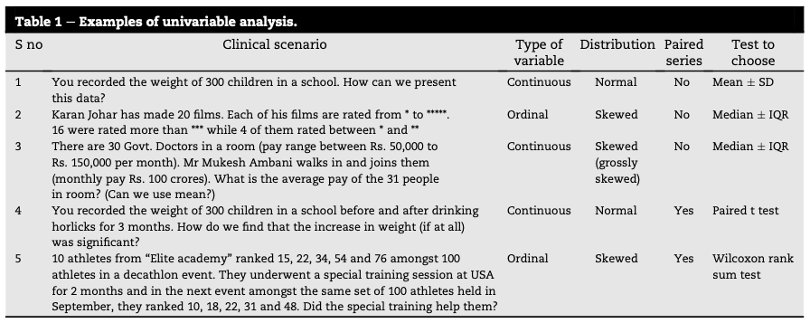
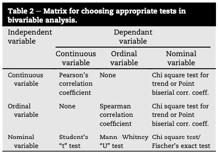
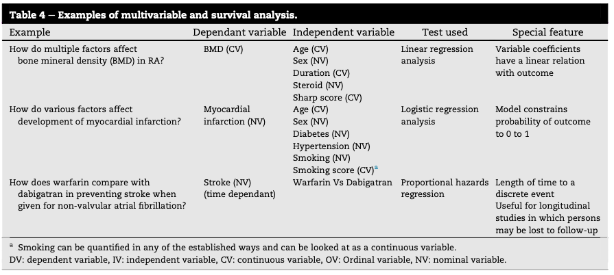

# 🔍 Detalhamento dos Tópicos de Estudo

Este documento irá abordar os detalhes dos tópicos de estudo.

---

## Testes Estatísticos

- Objetivo Geral: É crucial para profissionais, especialmente na área médica, compreender e analisar criticamente trabalhos de pesquisa, bem como planejar seus próprios estudos. No entanto, a estatística é frequentemente vista como um ponto fraco por muitos pesquisadores. O problema, segundo os autores Subramanian Shankar e Ramakant Singh, não está na complexidade inerente da estatística em si, mas na forma como é ensinada, com excesso de ênfase em detalhes técnicos em vez dos princípios fundamentais. Isso leva a um uso muito comum de testes estatísticos errados ou inadequados em pesquisas publicadas. Esse artigo se propõe a ser um guia prático, focando na pergunta fundamental: "qual teste estatístico deve ser usado em qual situação?".
- **DOI**: [10.1109/j.injr.2014.04.002](https://journals.sagepub.com/doi/10.1016/j.injr.2014.04.002)
- **Link para o artigo**: [Demystifying Statistics: How to choose a statistical test](https://github.com/Reinaldo-Jr-Dev/doutorado/blob/article/Demystifying_Statistics_How_to_choose_a_statistical_test.pdf)

### A Abordagem de Cinco Passos
O cerne da metodologia proposta reside em uma abordagem sistemática, onde o processo começa com a formulação de uma questão de pesquisa em "linguagem comum" (Passo 1). Esta é a etapa mais crítica e frequentemente negligenciada. Uma vez que a pergunta é claramente definida, ela precisa ser traduzida para a "linguagem estatística" (Passo 2 - é essencialmente a linguagem das variáveis). Após a aplicação do "teste estatístico apropriado" (Passo 3), a "resposta é obtida" (Passo 4) é "convertida para a linguagem original" (Passo 5) para fornecer o resultado final.

### Entendendo as Variáveis: A Chave para a Tradução Estatística
Uma variável é definida como qualquer característica ou medição em um estudo que será analisada – desde altura e peso até o status de fumante ou a ocorrência de um AVC.
As variáveis são classificadas de duas maneiras principais:
- Baseado na sua natureza inerente:
  - Nominal (NV): Categorias sem ordem (exemplos: sexo, estado civil).
  - Ordinal (OV): Categorias com uma ordem natural, mas sem intervalos iguais (exemplos: escalas de dor, classificação de filmes por estrelas).
  - Contínua (CV): Valores numéricos com intervalos iguais e um ponto zero significativo (exemplos: altura, peso, pressão arterial).
- Baseado na relação com outras variáveis:
  - Variável Dependente (DV) ou de Resposta: A variável de interesse primário para o pesquisador, o "resultado" que se quer explicar ou prever. Todo estudo tem pelo menos uma DV.
  - Variável Independente (IV) ou Explicatória: As variáveis que podem influenciar ou explicar uma fração da DV. Pode haver muitas IVs afetando uma única DV.

Os autores dão um exemplo claro: em um estudo sobre múltiplos fatores (idade, tabagismo, diabetes, hipertensão, hipercolesterolemia) que afetam o desenvolvimento de infarto do miocárdio, o infarto do miocárdio seria a DV, e os outros fatores seriam as IVs. É importante notar que tanto DVs quanto IVs podem ser nominais, ordinais ou contínuas.

- Testes Estatísticos: Paramétricos e Não Paramétricos
  - Testes Paramétricos: São testes estatísticos que fazem suposições específicas sobre a distribuição dos dados na população de onde a amostra foi retirada. A suposição mais comum e crucial é que os dados seguem uma distribuição normal. Além disso, frequentemente assumem homogeneidade de variâncias.
Exemplos de uso: Teste t de Student (para comparar médias de dois grupos) e ANOVA (Análise de Variância) (para comparar médias de três ou mais grupos).
  - Testes Não Paramétricos: Também conhecidos como testes "livres de distribuição", são testes estatísticos que não fazem suposições específicas sobre a forma da distribuição dos dados na população. Eles são mais flexíveis e podem ser aplicados a uma gama mais ampla de tipos de dados. Exemplos deuso: Teste de Mann-Whitney, Teste de Kruskal-Wallis e Teste de Wilcoxon.
 
### Tipos de Análise e Testes Estatísticos
O artigo detalha os tipos de análise que podem ser realizados: univariada, bivariada e multivariada.
- Análise Univariada
  - Essa análise é usada para descrever as características de base dos pacientes. O foco está em apresentar os dados usando medidas de tendência central e dispersão, sem fazer comparações entre grupos. O artigo fornece exemplos práticos (Tabela 1) que ilustram essas escolhas.

**Tabela 1:** Análise Univariada

- Análise Bivariada
  - Este é o tipo de teste mais comum na literatura científica, onde se examina a relação entre duas variáveis (uma DV e uma IV). A complexidade surge porque tanto a DV quanto a IV podem ser nominais, ordinais ou contínuas, resultando em várias combinações possíveis. O artigo apresenta uma matriz útil (Tabela 2) para guiar a escolha:

**Tabela 2:** Análise Bivariada

- Análise Multivariada 
  - Em situações clínicas, múltiplos fatores de risco (IVs) podem influenciar um único evento ou resultado (DV). A análise multivariada é uma ferramenta poderosa para determinar as contribuições únicas de cada fator de risco para o resultado, ajustando para a influência de outras variáveis. Por exemplo, ela permite demonstrar que o tabagismo tem uma relação independente com a doença coronariana, mesmo após ajustar para fatores como idade, sexo, diabetes ou sedentarismo. Isso é feito matematicamente por softwares estatísticos que isolam o efeito de um único fator de interesse enquanto controlam os outros. O artigo lista exemplos comuns na Tabela 3.

**Tabela 3:** Análise Multivariada

### Como Escolher o Teste Estatístico Mais Apropriado

A essência da escolha do teste estatístico reside em uma tradução precisa da sua questão de pesquisa para os termos estatísticos, focando nas características das suas variáveis e no tipo de relação que você busca investigar.

  1. Comece pela Questão de Pesquisa (em Linguagem Simples)
    - Este é o passo mais crucial. Defina claramente o que você quer investigar, comparar ou associar. Uma pergunta de pesquisa bem formulada em termos compreensíveis é o ponto de partida para tudo.
    - Exemplo: "A idade está relacionada ao risco de infarto do miocárdio?" ou "O novo tratamento reduz a dor de forma significativa?".
  2. Identifique as Variáveis (DV - Variável Dependente ou IV - Variável Independente)**
    - Exemplo: Em "A idade está relacionada ao risco de infarto?", "Risco de infarto" é a DV e "Idade" é a IV.
  3. Classifique Suas Variáveis: A forma como suas variáveis são medidas determinará os testes possíveis.
    - Nominal (NV), Ordinal (OV) ou Contínua (CV).
  4. Verifique a Distribuição dos Dados (para Variáveis Contínuas):
    - Para variáveis contínuas, é fundamental saber se elas seguem uma distribuição normal (dados simétricos, em forma de sino) ou uma distribuição assimétrica (skewed).
    - Testes Paramétricos: Usados para dados contínuos com distribuição normal. São geralmente mais poderosos.
    - Testes Não Paramétricos: Usados para dados contínuos com distribuição assimétrica, ou para variáveis ordinais e nominais. Se houver dúvida sobre a normalidade, os testes não paramétricos são a opção mais segura. 
  5. Determine o Tipo de Análise: Univariada, Bivariada ou Multivariada.	
