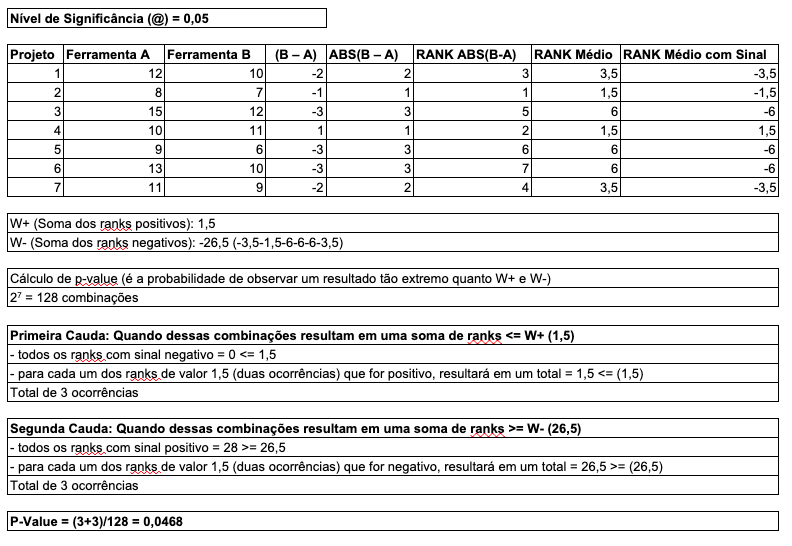
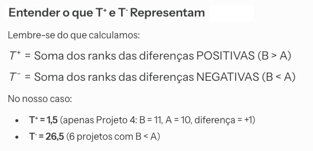
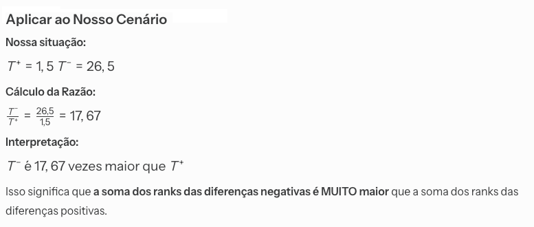
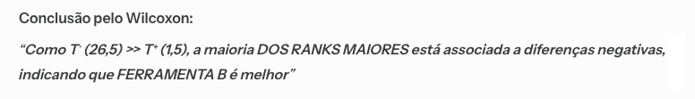
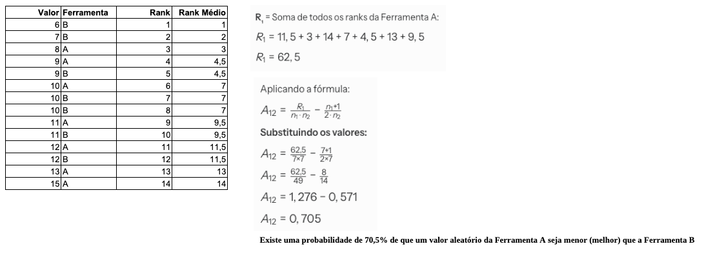
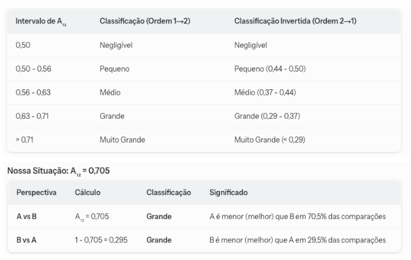

# 🔍 Detalhamento dos Tópicos de Estudo

Este documento irá abordar os detalhes dos tópicos de estudo.

---

## Testes Estatísticos

Um teste estatístico é um método formal e sistemático utilizado para tomar decisões sobre uma população com base em dados de uma amostra. **Em sua essência, ele nos permite avaliar a probabilidade de que os resultados observados em um experimento ou estudo sejam devidos ao acaso ou se realmente representam uma relação real entre variáveis**.
Imagine que se esteja desenvolvendo uma nova metodologia para um software e quer saber se ela realmente melhora o desempenho em comparação com a metodologia anterior. **Um teste estatístico pode te ajudar a determinar se a diferença observada entre os experimentos é estatisticamente significativa, e não apenas uma variação aleatória**.

Conceitos Fundamentais:
  - **Hipótese Nula (H₀): É a afirmação a ser testada, que geralmente assume que não há efeito, não há diferença ou não há relação entre as variáveis na população**. Exemplo: Considerando o cenário do evento de software, H₀ poderia representar que não há diferença significativa no desempenho entre a nova metodologia e a antiga.
  - Hipótese Alternativa (H₁ ou Hₐ): É a afirmação que se espera que seja verdadeira ou que está tentando ser provada. Ela contradiz a hipótese nula. Exemplo: Há uma diferença significativa no desempenho entre a nova metodologia e a antiga ou a nova metodologia melhora o desempenho. O objetivo do teste estatístico é determinar se há evidência suficiente para rejeitar a H₀ em favor da H₁.
  - Nível de Significância (α): Também conhecido como alfa, é um limiar de probabilidade pré-definido (comumente 0.05 ou 5%) que representa o risco máximo que você está disposto a aceitar de cometer um erro.
  - Valor-p (p-value): **O p-value é a probabilidade de observar resultados extremos quanto aos dados coletados, assumindo que a hipótese nula é verdadeira. Se (p-value < α), possui evidências suficientes para rejeitar a hipótese nula (H₀). Se (p-value ≥ α), não tem evidências suficientes para rejeitar a hipótese nula. Isso significa que os dados não fornecem suporte forte o suficiente para hipótese de H₁**.
    
## Teste Estatístico Wilcoxon Signed Rank
Por que o Teste de Wilcoxon Signed-Rank é Ideal para o cenário da nossa pesquisa?
  - Dados Emparelhados/Dependentes:
    - Podemos comparar dois formatos da matriz de espectro de controle para a mesma versão de projeto e mesma heurística. Isso significa que as observações são naturalmente emparelhadas.
  - Natureza Não-Paramétrica:
    - Métricas como o MFR (Mean First Rank) não seguem uma distribuição normal.
  - Comparações de Medianas:
    - O teste avalia se existe uma diferença estatisticamente significativa nas medianas das diferenças entre os pares. Essa medida de tendência central é utilizada pelo fato dos dados serem não-paramétricos.

### Exemplo de aplicação (Teste Estatístico Wilcoxon Signed Rank)
Um teste estatístico é um método formal e sistemático utilizado para tomar decisões sobre uma população com base em dados de uma amostra. Em sua essência, ele nos permite avaliar a probabilidade de que os resultados observados em um experimento ou estudo sejam devidos ao acaso ou se realmente existe uma relação real entre as variáveis.

Cenário: Uma empresa de desenvolvimento de software está testando duas ferramentas de análise estática de código (Ferramenta A e Ferramenta B) para identificar vulnerabilidades. Eles aplicam ambas as ferramentas em 7 projetos diferentes e registram o "número de vulnerabilidades críticas não detectadas" por cada ferramenta (um valor menor é melhor).

  - Hipótese Nula (H₀): Não há diferença significativa no desempenho para identificar vulnerabilidades entre as ferramentas A e B.
  - Hipótese Alternativa (H₁): A hipótese de que a Ferramenta B é melhor que a Ferramenta A se confirma (os valores da Ferramenta B são menores que a Ferramenta A)?



Análise de qual Ferramenta é a melhor (Ferramenta A x Ferramenta B)







Conclusões: 
  - Como **p-value (0,0468) < @ (0,05)**, há evidências estatísticas significativas para rejeitar a hipótese nula (H₀). Isso significa que há uma diferença significativa no número de vulnerabilidades críticas não detectadas entre a Ferramenta A e a Ferramenta B.
  - Considerando a análise realizada por meio da Tabela do teste Wilcoxon Signed-Ranks, com nível de significância α = 0,05 e tamanho amostral n = 7, observa-se que o valor crítico correspondente é 2. Dessa forma, como T (1,5) < T_crítico (2), rejeita-se a hipótese nula (H₀).
  - Com base no Teste de Wilcoxon Signed-Rank, a Ferramenta B é melhor que a Ferramenta A para detectar vulnerabilidades críticas.

## Teste Estatístico de Vargha & Delaney
O teste de Vargha e Delaney é um teste não paramétrico utilizado para medir o tamanho do efeito entre duas amostras independentes. Esse teste quantifica a magnitude da diferença observada entre as amostras, classificando-a em pequeno, médio, grande ou muito grande efeito. Em outras palavras, o teste não tem como objetivo verificar se existe uma diferença estatisticamente significativa entre as amostras, mas sim avaliar a relevância dessa diferença. Para maior clareza, o teste estatístico será aplicado ao cenário previamente descrito.





## Implementação de Teste Estatístico - Wilcoxon Signed Rank e Vargha & Delaney
```python
from scipy import stats
import numpy as np

# Dados: número de vulnerabilidades NÃO detectadas
ferramenta_a = [12, 8, 15, 10, 9, 13, 11]
ferramenta_b = [10, 7, 12, 11, 6, 10, 9]

alpha = 0.05

print("=" * 60)
print("TESTE DE WILCOXON SIGNED-RANK - COMPARAÇÃO DE FERRAMENTAS")
print("=" * 60)

# ========== ABORDAGEM 1: TESTE BICAUDAL ==========
print("\n[ETAPA 1] TESTE BICAUDAL - Há Diferença?")
print("-" * 60)

w_stat_bicaudal, p_value_bicaudal = stats.wilcoxon(
    ferramenta_a, 
    ferramenta_b, 
    alternative='two-sided'
)

print(f"\nEstatística W: {w_stat_bicaudal}")
print(f"P-valor (bicaudal): {p_value_bicaudal:.5f}")

if p_value_bicaudal < alpha:
    print(f"✓ RESULTADO: Há diferença significativa (p < {alpha})")
    diferenca_significativa = True
else:
    print(f"✗ RESULTADO: Não há diferença significativa (p ≥ {alpha})")
    diferenca_significativa = False

# ========== ABORDAGEM 2: TESTES UNICAUDAIS ==========
if diferenca_significativa:
    print("\n[ETAPA 2] TESTES UNICAUDAIS - Qual é Melhor?")
    print("-" * 60)

    # Teste Unicaudal 1: A melhor que B? (A < B)
    #  Ao calcular o valor de p_value_a_melhor, como a maioria dos dados estão 
    #   na cauda direita (valores positivos dominam), então o cálculo dessa variável
    #   ocorre da seguinte forma: p_value_a_melhor = 1 - p_value_b_melhor
    print("\nTeste 1: Ferramenta A Melhor que B?")
    w_stat_a_melhor, p_value_a_melhor = stats.wilcoxon(
        ferramenta_a, 
        ferramenta_b, 
        alternative='less'
    )
    print(f"Estatística W: {w_stat_a_melhor}")
    print(f"P-valor: {p_value_a_melhor:.5f}")

    if p_value_a_melhor < alpha:
        print(f"✓ Ferramenta A é melhor (p < {alpha})")
        ferramente_melhor = "A"
    else:
        print(f"✗ Ferramenta A não é melhor (p ≥ {alpha})")

    # Teste Unicaudal 2: B melhor que A? (B < A)
    print("\nTeste 2: Ferramenta B Melhor que A?")
    w_stat_b_melhor, p_value_b_melhor = stats.wilcoxon(
        ferramenta_a, 
        ferramenta_b, 
        alternative='greater'
    )
    print(f"Estatística W: {w_stat_b_melhor}")
    print(f"P-valor: {p_value_b_melhor:.5f}")

    if p_value_b_melhor < alpha:
        print(f"✓ Ferramenta B é melhor (p < {alpha})")
        ferramente_melhor = "B"
    else:
        print(f"✗ Ferramenta B não é melhor (p ≥ {alpha})")

else:
    print("\n[ETAPA 2] PULADA - Não há diferença significativa para testar direção.")

# ========== ABORDAGEM 3: ANÁLISE DESCRITIVA ==========
print("\n[ETAPA 3] ANÁLISE DESCRITIVA - Quantificação da Diferença")
print("-" * 60)

media_a = np.mean(ferramenta_a)
media_b = np.mean(ferramenta_b)
mediana_a = np.median(ferramenta_a)
mediana_b = np.median(ferramenta_b)
std_a = np.std(ferramenta_a, ddof=1)
std_b = np.std(ferramenta_b, ddof=1)

print(f"\nFerramenta A:")
print(f"  Média: {media_a:.2f}")
print(f"  Mediana: {mediana_a:.2f}")
print(f"  Desvio Padrão: {std_a:.2f}")

print(f"\nFerramenta B:")
print(f"  Média: {media_b:.2f}")
print(f"  Mediana: {mediana_b:.2f}")
print(f"  Desvio Padrão: {std_b:.2f}")

print(f"\nDiferenças:")
print(f"  Diferença de Médias: {abs(media_a - media_b):.2f}")
print(f"  Diferença de Medianas: {abs(mediana_a - mediana_b):.2f}")

if media_a < media_b:
    reducao = ((media_b - media_a) / media_b) * 100
    print(f"\n✓ Ferramenta A detecta em média {reducao:.1f}% MAIS vulnerabilidades.")
    print(f"  (A tem {media_a:.2f} não detectadas vs B com {media_b:.2f})")
else:
    reducao = ((media_a - media_b) / media_a) * 100
    print(f"\n✓ Ferramenta B detecta em média {reducao:.1f}% MAIS vulnerabilidades.")
    print(f"  (B tem {media_b:.2f} não detectadas vs A com {media_a:.2f})")

# ========== CONCLUSÃO FINAL ==========
print("\n" + "=" * 60)
print("CONCLUSÃO FINAL")
print("=" * 60)

if diferenca_significativa:
    if p_value_b_melhor < alpha:
        print("\n✓ A Ferramenta B é SIGNIFICATIVAMENTE MELHOR que a Ferramenta A")
        print(f"  para detectar vulnerabilidades críticas (p = {p_value_b_melhor:.5f}).")
    elif p_value_a_melhor < alpha:
        print("\n✓ A Ferramenta A é SIGNIFICATIVAMENTE MELHOR que a Ferramenta B")
        print(f"  para detectar vulnerabilidades críticas (p = {p_value_a_melhor:.5f}).")
else:
    print("\n✗ Não há diferença estatisticamente significativa entre as ferramentas.")
    print("  Ambas têm desempenho equivalente para detectar vulnerabilidades críticas.")

print("\n" + "=" * 60)
```

Fontes:
  - A theoretical analysis on cloning the failed test cases to improve spectrum-based fault localization (Long Zhang, Lanfei Yan, Zhenyu Zhang, Jian Zhang, W.K. Chand, Zheng Zheng).
  - MathWorld, W., The web’s most extensive mathematics resource, 2010Access on: http://mathworld.wolfram.com.
  - A Critique and Improvement of the CL Common Language Effect Size Statistics of McGraw and Wong (Vargha, A. & Delaney, H. D.).
