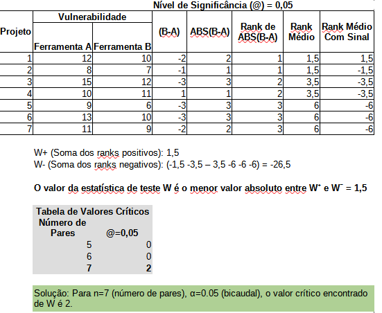

# 🔍 Detalhamento dos Tópicos de Estudo

Este documento irá abordar os detalhes dos tópicos de estudo.

---

## Testes Estatísticos

O principal propósito de um teste estatístico é ajudar a inferir conclusões sobre uma população maior a partir de uma amostra limitada, quantificando a incerteza associada a essas inferências. Ele nos dá uma estrutura para:

  - Avaliar hipóteses: Confirmar ou refutar suposições sobre um parâmetro populacional ou a relação entre variáveis.
  - Tomar decisões informadas: Direcionar a escolha entre diferentes alternativas baseadas em evidências empíricas.
  - Quantificar a evidência: Fornecer um valor de probabilidade (p-value) que indica o quão forte é a evidência contra uma hipótese inicial.

As pesquisas em SBFL frequentemente empregam testes estatísticos formais para avaliar, comparar e validar o desempenho de diferentes algoritmos ou variações. Estes são testes de hipótese clássicos que permitem aos pesquisadores tirar conclusões robustas sobre a significância dos resultados.

Para que o teste estatístico possa analisar a variabilidade e a significância estatística das diferenças, ele precisa de múltiplas observações (ou repetições) para cada combinação única de suas variáveis independentes (projetos + versão, heurísticas e técnica de balanceamento).

## Testes Estatísticos aplicado a SBFL

Importância de se trabalhar com Teste Estatíticos em SBFL
  - Permitem que as descobertas sejam generalizadas.
  - Ajudam a realizar a comparação entre as variáveis independentes e a análise de sua relevância.
    
Cenário de dados da proposta de pesquisa:
  - Variável Dependente: MFR (Mean First Rank).
  - Fatores Fixos (de Interesse) ou Variáveis Independentes:
    - Heurísticas (6 níveis): Você quer comparar o desempenho médio das 6 heurísticas.
    - Formatos da Matriz de Espectro (N formatos).
  - Unidades Experimentais: Defects4J (Projetos + Versões).

## Teste Estatístico Wilcoxon Signed Rank
Por que o Teste de Wilcoxon Signed-Rank é Ideal para o cenário da nossa pesquisa?
  - Dados Emparelhados/Dependentes:
    - Podemos comparar dois formatos da matriz de espectro de controle para a mesma versão de projeto e mesma heurística. Isso significa que as observações são naturalmente emparelhadas.
  - Natureza Não-Paramétrica:
    - Métricas como o MFR (Mean First Rank) não seguem uma distribuição normal.
  - Comparações de Medianas:
    - O teste avalia se existe uma diferença estatisticamente significativa nas medianas das diferenças entre os pares. Essa medida de tendência central é utilizada pelo dato dos dados serem não-paramétricos.

### Exemplo de aplicação (Teste Estatístico Wilcoxon Signed Rank)
Cenário: Uma empresa de desenvolvimento de software está testando duas ferramentas de análise estática de código (Ferramenta A e Ferramenta B) para identificar vulnerabilidades. Eles aplicam ambas as ferramentas em 7 projetos diferentes e registram o "número de vulnerabilidades críticas não detectadas" por cada ferramenta (um valor menor é melhor).

**Imagem 1** - Explicação do Teste Estatístico Wilcoxon Signed Rank

Conclusão
  - Como o valor de W calculado de 1,5 é menor ou igual ao valor crítico 2, rejeitamos a hipótese nula (é a afirmação a ser testada, que geralmente assume que não há efeito, não há diferença ou não há relação entre as variáveis na população).
  - Com base neste exemplo, e considerando um nível de significância de 0.05, há evidências estatísticas significativas para rejeitar a hipótese nula. Isso significa que há uma diferença significativa na mediana do número de vulnerabilidades críticas não detectadas entre a Ferramenta A e a Ferramenta B.
