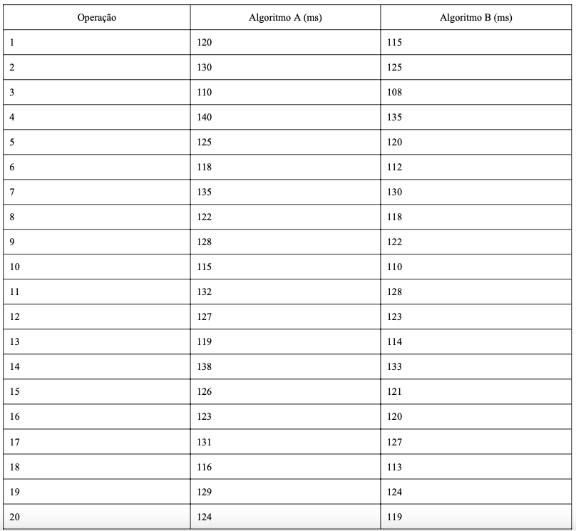

# 🔍 Detalhamento dos Tópicos de Estudo

Este documento irá abordar os detalhes dos tópicos de estudo.

---

## Testes Estatísticos

O principal propósito de um teste estatístico é ajudar a inferir conclusões sobre uma população maior a partir de uma amostra limitada, quantificando a incerteza associada a essas inferências. Ele nos dá uma estrutura para:

  - Avaliar hipóteses: Confirmar ou refutar suposições sobre um parâmetro populacional ou a relação entre variáveis.
  - Tomar decisões informadas: Direcionar a escolha entre diferentes alternativas baseadas em evidências empíricas.
  - Quantificar a evidência: Fornecer um valor de probabilidade (p-value) que indica o quão forte é a evidência contra uma hipótese inicial.

As pesquisas em SBFL frequentemente empregam testes estatísticos formais para avaliar, comparar e validar o desempenho de diferentes algoritmos ou variações. Estes são testes de hipótese clássicos que permitem aos pesquisadores tirar conclusões robustas sobre a significância dos resultados.

Para que o teste estatístico possa analisar a variabilidade e a significância estatística das diferenças, ele precisa de múltiplas observações (ou repetições) para cada combinação única de suas variáveis independentes (projetos + versão, heurísticas e técnica de balanceamento).

### Exemplo de Aplicação

Cenário: Uma equipe de desenvolvimento otimizou um algoritmo de busca (Algoritmo B) e acredita que ele é mais rápido que a versão atual (Algoritmo A). Você decide fazer um experimento para verificar isso. Foi selecionado 20 operações de busca representativas. Para cada operação, você mede o tempo de execução (em milissegundos) tanto com o Algoritmo A quanto com o Algoritmo B.



**Tabela 1:** Tabela de Simulações

```python
import numpy as np
from scipy import stats

alg_a = np.array([120, 130, 110, 140, 125, 118, 135, 122, 128, 115, 132, 127, 119, 138, 126, 123, 131, 116, 129, 124])
alg_b = np.array([115, 125, 108, 135, 120, 112, 130, 118, 122, 110, 128, 123, 114, 133, 121, 120, 127, 113, 124, 119])

# Realizar o Teste t de Student Pareado
t_statistic, p_value = stats.ttest_rel(alg_a, alg_b)

print(f"Média Algoritmo A: {np.mean(alg_a):.2f} ms")
print(f"Média Algoritmo B: {np.mean(alg_b):.2f} ms")
print(f"Estatística t: {t_statistic:.3f}")
print(f"Valor p: {p_value:.4f}")

alpha = 0.05
if p_value < alpha:
    print(f"Com p-value ({p_value:.4f}) < {alpha}, rejeitamos a hipótese nula.")
    print("Há uma diferença estatisticamente significativa no tempo de execução.")
    if np.mean(alg_b) < np.mean(alg_a):
        print(f"O Algoritmo B (Média={np.mean(alg_b):.2f}) é significativamente mais rápido que o Algoritmo A (Média={np.mean(alg_a):.2f}).")
    else:
        print(f"O Algoritmo A é significativamente mais rápido que o Algoritmo B.")
else:
    print(f"Com p-value ({p_value:.4f}) >= {alpha}, não rejeitamos a hipótese nula.")
    print("Não há evidência estatística suficiente para afirmar que há uma diferença significativa no tempo de execução entre os algoritmos.")
    print("A diferença observada de {np.mean(alg_a) - np.mean(alg_b):.2f} ms pode ser devido ao acaso.")

```
**Fragmento de Código 1** - Teste Estatítico (Teste t Pareado)

## Testes Estatísticos Aplicado a SBFL

Importância de se trabalhar com Teste Estatítico
  - Os testes estatísticos permitem que você generalize suas descobertas. Eles ajudam a responder: A diferença que observei nos resultados MFR é apenas uma coincidência para este conjunto limitado de bugs, ou ela é representativa de uma diferença real e consistente que se aplicaria a outros bugs semelhantes que não estavam no Defects4J.
  - Você provavelmente está comparando sua heurística com outras existentes (benchmarks). Suponha que sua heurística H1 tenha um MFR de 0.20 e uma heurística H2 (baseline) tenha um MFR de 0.25. Numericamente, 0.20 é melhor que 0.25. Mas essa diferença de 0.05 é estatisticamente significativa? Ou ela poderia ser apenas uma variação trivial que não representa uma melhoria substancial ou confiável?

Cenário de dados da proposta de pesquisa:
  - Variável Dependente: MFR (Mean First Rank) – Uma métrica contínua de desempenho.
  - Fatores Fixos (de Interesse) ou Variáveis Independentes:
    - Heurísticas (6 níveis): Você quer comparar o desempenho médio das 6 heurísticas.
    - Formatos de Espectro (N formatos).
  - Unidades Experimentais: Defects4J (Projetos + Versões).
  - 
<mark>De acordo com esse cenário o Modelo Linear Misto (LMM) é a técnica estatística mais indicada.</mark>

### Exemplo de Código

```python
import numpy as np
import pandas as pd
import statsmodels.formula.api as smf
import matplotlib.pyplot as plt
import seaborn as sns

# Dados fornecidos, em formato de string para simular um arquivo CSV
data_string = """
Chart_v1; Ochiai, Matriz_I, 480
Chart_v1; Ochiai, Matriz_2, 98
Chart_v1; Tarantula, Matriz_I, 234
Chart_v1; Tarantula, Matriz_2, 217
Chart_v1; Jaccard, Matriz_I, 481
Chart_v1; Jaccard, Matriz_2, 133
Chart_v1; OP2, Matriz_I, 557
Chart_v1; OP2, Matriz_2, 133
Chart_v1; Barinel, Matriz_I, 234
Chart_v1; Barinel, Matriz_2, 219
Chart_v1; Dstar, Matriz_I, 509
Chart_v1; Dstar, Matriz_2, 1602
Chart_v2; Ochiai, Matriz_I, 490
Chart_v2; Ochiai, Matriz_2, 108
Chart_v2; Tarantula, Matriz_I, 254
Chart_v2; Tarantula, Matriz_2, 237
Chart_v2; Jaccard, Matriz_I, 491
Chart_v2; Jaccard, Matriz_2, 163
Chart_v2; OP2, Matriz_I, 587
Chart_v2; OP2, Matriz_2, 163
Chart_v2; Barinel, Matriz_I, 264
Chart_v2; Barinel, Matriz_2, 259
Chart_v2; Dstar, Matriz_I, 549
Chart_v2; Dstar, Matriz_2, 1902
"""

# Processar a string para criar o DataFrame
data_list = []
for line in data_string.strip().split('\n'):
    bug_id_part, rest = line.split(';')
    heuristic, matrix_format, rank_value = rest.split(',')
    data_list.append({
        'Bug_ID': bug_id_part.strip(),
        'Heuristica': heuristic.strip(),
        'Formato_Espectro': matrix_format.strip(),
        'Rank_Value': int(rank_value.strip())
    })

df = pd.DataFrame(data_list)

# Converter colunas para os tipos corretos
# Bug_ID, Heuristica e Formato_Espectro devem ser categóricos para o LMM
df['Bug_ID'] = pd.Categorical(df['Bug_ID'])
df['Heuristica'] = pd.Categorical(df['Heuristica'])
df['Formato_Espectro'] = pd.Categorical(df['Formato_Espectro'])

print("DataFrame com os dados:")
print(df.head())
print(f"\nTotal de observações: {len(df)}")
print(f"Número de Bug_IDs únicos: {df['Bug_ID'].nunique()}")
print(f"Número de Heurísticas únicas: {df['Heuristica'].nunique()}")
print(f"Número de Formatos de Espectro únicos: {df['Formato_Espectro'].nunique()}\n")

# Gráfico de interação: MFR (Rank_Value) por Heurística e Formato de Espectro
plt.figure(figsize=(14, 8))
sns.pointplot(data=df, x='Heuristica', y='Rank_Value', hue='Formato_Espectro', dodge=True, errorbar='sd', palette='viridis')
plt.title('Rank Value por Heurística e Formato de Espectro')
plt.xlabel('Heurística')
plt.ylabel('Rank do Elemento Defeituoso (MFR)') # MFR é uma média de ranks
plt.xticks(rotation=45, ha='right')
plt.grid(True, linestyle='--', alpha=0.6)
plt.tight_layout()
plt.show()

# Boxplot geral para Heurísticas
plt.figure(figsize=(12, 6))
sns.boxplot(data=df, x='Heuristica', y='Rank_Value', palette='coolwarm')
plt.title('Distribuição do Rank Value por Heurística (Geral)')
plt.xlabel('Heurística')
plt.ylabel('Rank do Elemento Defeituoso (MFR)')
plt.xticks(rotation=45, ha='right')
plt.grid(axis='y', linestyle='--', alpha=0.6)
plt.tight_layout()
plt.show()

try:
    # Ajustar o Modelo Linear Misto
    # 'groups=df["Bug_ID"]' especifica a variável de agrupamento para o efeito aleatório
    model = smf.mixedlm("Rank_Value ~ C(Heuristica) * C(Formato_Espectro)", df, groups=df["Bug_ID"])
    result = model.fit()
    
    print("--- Sumário Detalhado do Modelo Linear Misto (LMM) ---")
    print(result.summary())

except Exception as e:
    print(f"Ocorreu um erro ao rodar o mixedlm: {e}")
    print("Possíveis causas: dados insuficientes para o número de grupos/fatores,")
    print("ou dados com pouca variabilidade para estimar o modelo.")
```
**Fragmento de Código 2** Código - Modelo Linear Misto (LMM)


